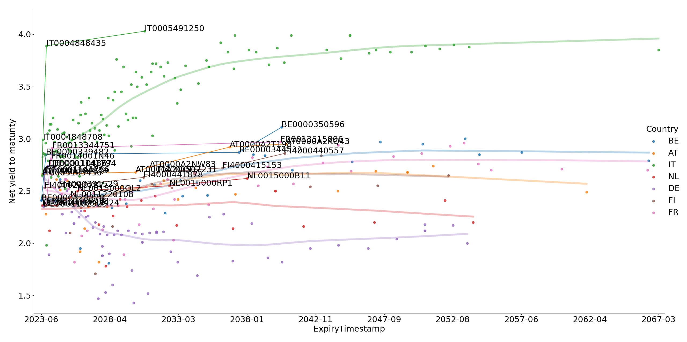

# Bond Tracker
A simple python scraper to get information about bonds available on the italian marker (Borsa Italiana).
I use it to get an idea of what bonds I should buy for the equity part of my portfolio.

## How it works?
There are three phases:
1. Get the list of bonds available on the market. The results is saved as a `.csv`.
2. Parse the page of each bond found. The results compound in a single `.csv`.
3. Data analysis. In the provided example you see the yield vs the expiration date for some selected countries
